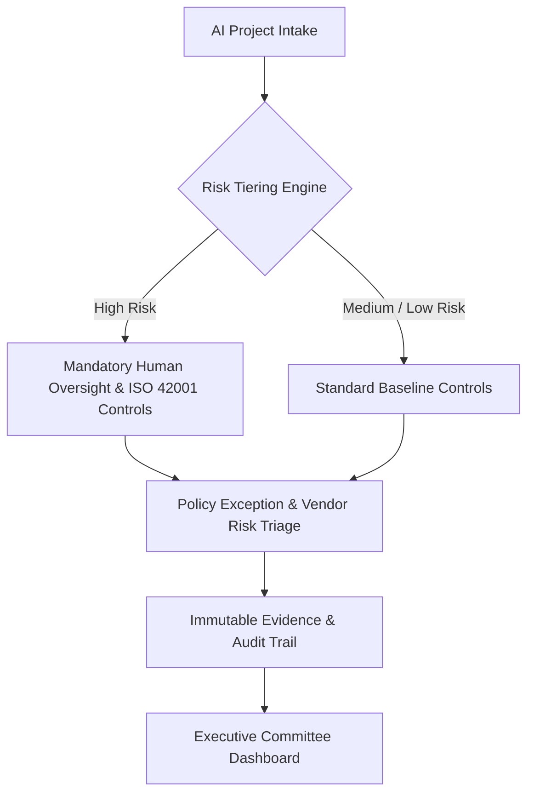

# AI Governance Control Tower — Executive Showcase

  <strong>Enterprise-Grade AI Management System & Control Tracking Architecture</strong> 
  Aligned with ISO/IEC 42001 & NIST AI Risk Management Framework (RMF)

  <a href="https://ai-governance-control-tower.vercel.app/"><strong>Live Interactive Web Application</strong></a> •
  <a href="https://www.jovanfranco.com"><strong>Website & Executive Insights</strong></a> •
  <a href="https://github.com/jovfranco-tech"><strong>GitHub Profile</strong></a>

---

## Executive Overview

The **AI Governance Control Tower** is an architectural showcase and decision-support prototype designed for Chief Information Officers (CIOs), Chief AI Officers (CAIOs), and Enterprise Risk Committees. It demonstrates how organizations can systematically govern AI initiatives across the entire lifecycle—from intake risk scoring to control selection, policy exception management, third-party vendor risk assessment, and audit-ready evidence logging.

---

## Live Interactive Application

Experience the functional web application interface directly in your browser:
👉 **[Open Live Demo: AI Governance Control Tower](https://ai-governance-control-tower.vercel.app/)**

> [!NOTE]
> **Portfolio Showcase & Synthetic Data Scope**:
> This repository is a documentation-only portfolio showcase. The live demonstration operates with representative synthetic datasets and deterministic scenarios. It does not process real tenant data or confidential enterprise metrics, and does not constitute formal legal or regulatory certification.

---

## High-Level System Architecture

---

## Key Functional Capabilities

1. **AI Use-Case Intake & Risk Scoring**:
   - Automated risk classification based on impact, autonomy, data sensitivity, and regulatory exposure.
   - Alignment with ISO/IEC 42001 AI Management System standards and NIST AI RMF guidance.

2. **Control Recommendation & Tracking**:
   - Dynamic mapping of baseline safety, transparency, bias mitigation, and data privacy controls.
   - Real-time compliance readiness scoring across organizational domains.

3. **Policy Exception & Vendor Risk Lifecycle**:
   - Formalized workflow for tracking policy exceptions, expiration dates, and mitigating controls.
   - Comprehensive assessment of third-party AI vendor risk and supply-chain dependencies.

4. **Audit-Ready Evidence Ledger**:
   - Traceable evidence logging connecting executive decisions directly to underlying control documentation and human sign-offs.

---

## Technology Stack & Categories

- **User Interface**: React, TypeScript, Next.js, Tailwind CSS
- **Visualization & Metrics**: Dynamic Executive Dashboards & Interactive Data Grids
- **Standards & Frameworks**: ISO/IEC 42001, ISO 27001, ISO 22301, NIST AI RMF

---

## Responsible AI & Governance Limitations

- **Human-in-the-Loop Authority**: The Control Tower serves as a decision-support layer. Final approval, policy exceptions, and risk acceptances require explicit human authorization.
- **Non-Automated Compliance**: Using this prototype does not automatically satisfy statutory regulatory obligations without formal organizational audit and policy enforcement.

---

## Intellectual Property & Licensing

© Jovan Franco. All Rights Reserved.  
This repository is provided strictly as a public portfolio showcase and architectural overview. Reproduction, redistribution, or commercial use of this material without prior written consent is strictly prohibited.
