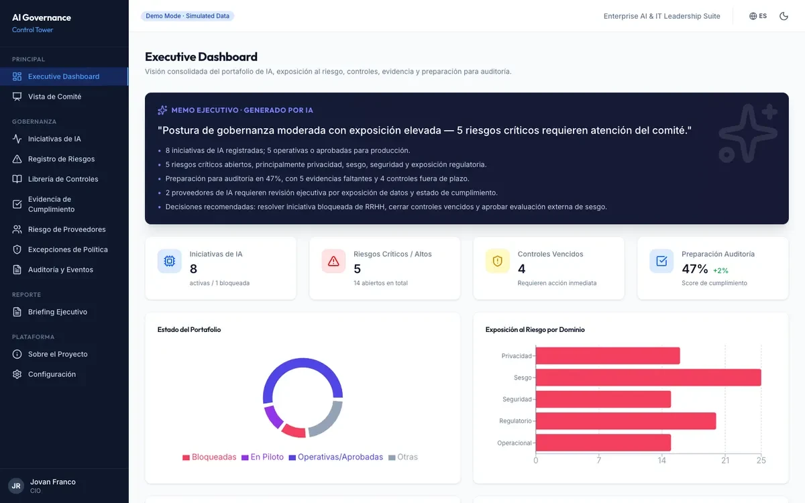
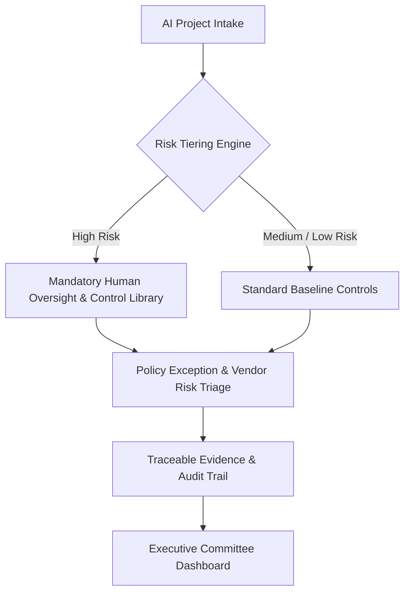

# AI Governance Control Tower — Executive Showcase

  

  <strong>Enterprise-oriented AI governance decision-support architecture</strong> 
  ISO/IEC 42001-inspired alignment & NIST AI Risk Management Framework (RMF) functional scope

  <a href="https://ai-governance-control-tower.vercel.app/"><strong>Live Interactive Web Application</strong></a> •
  <a href="https://www.jovanfranco.com"><strong>Website & Executive Insights</strong></a> •
  <a href="https://github.com/jovfranco-tech"><strong>GitHub Profile</strong></a>

---

## Executive Overview

The **AI Governance Control Tower** is an architectural portfolio showcase designed for Chief Information Officers (CIOs), Chief AI Officers (CAIOs), and Enterprise Risk Committees. It demonstrates how organizations can systematically govern AI initiatives across the entire lifecycle—from intake risk scoring to control selection, policy exception management, third-party vendor risk assessment, and audit-ready evidence tracking.

---

## Live Interactive Application

Experience the functional web application interface directly in your browser:
👉 **[Open Live Demo: AI Governance Control Tower](https://ai-governance-control-tower.vercel.app/)**

> [!NOTE]
> **Portfolio Showcase & Synthetic Data Scope**:
> This repository is a documentation-only portfolio showcase. The live demonstration operates with representative synthetic datasets and deterministic scenarios. It does not process real tenant data or confidential enterprise metrics. It does not imply formal ISO/IEC 42001 certification, regulatory approval, operational deployment, or guaranteed compliance.

---

## High-Level System Architecture

---

## Key Functional Capabilities

1. **AI Use-Case Intake & Risk Scoring**:
   - Automated risk classification based on impact, autonomy, data sensitivity, and regulatory exposure.
   - ISO/IEC 42001-inspired alignment and NIST AI RMF functional scope.

2. **Control Recommendation & Tracking**:
   - Dynamic mapping of baseline safety, transparency, bias mitigation, and data privacy controls.
   - Compliance readiness scoring across organizational domains.

3. **Policy Exception & Vendor Risk Lifecycle**:
   - Formalized workflow for tracking policy exceptions, expiration dates, and mitigating controls.
   - Assessment framework for third-party AI vendor risk and supply-chain dependencies.

4. **Traceable Evidence & Audit Trail**:
   - Traceable evidence logging connecting executive decisions directly to underlying control documentation and human sign-offs.

---

## Verified Technology Stack

- **Frontend**: React 19, TypeScript 6, Vite 8, React Router
- **Visualization & UI**: Recharts, Tailwind CSS 4
- **Persistence Architecture**: Supabase-ready persistence architecture
- **Testing**: Vitest

---

## Responsible AI & Governance Limitations

- **Human-in-the-Loop Authority**: The Control Tower serves as a decision-support architecture. Final approval, policy exceptions, and risk acceptances require explicit human authorization.
- **Non-Automated Compliance**: Using this prototype does not automatically satisfy statutory regulatory obligations without formal organizational audit and policy enforcement.

---

## Intellectual Property & Licensing

© Jovan Franco. All Rights Reserved.  
This repository is provided strictly as a public portfolio showcase and architectural overview. Reproduction, redistribution, or commercial use of this material without prior written consent is strictly prohibited.
